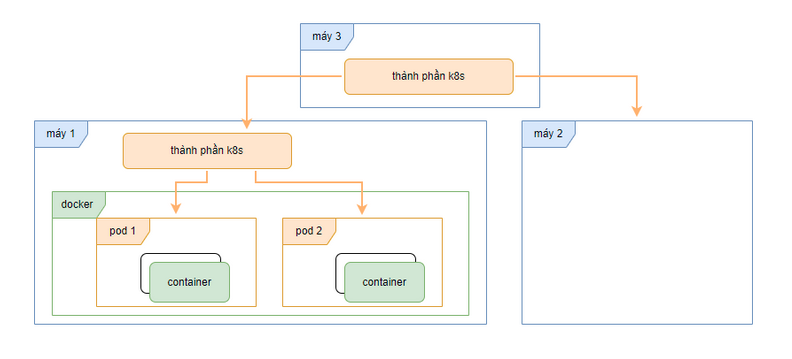

Next you can update your site name, avatar and other options using the _config.yml file in the root of your repository (shown below).

The easiest way to make your first post is to edit this one. Go into /_posts/ and update the Hello World markdown file. For more instructions head over to the [Kiko Now repository](https://github.com/aweekj/kiko-now) on GitHub.