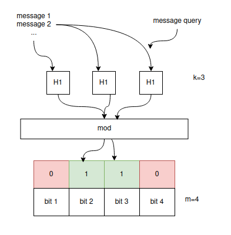

có thì chưa chắc có, nhưng không thì chắc chắn là không

# khái niệm 
- là một cấu trúc dữ liệu dựa trên xác xuất 
- cho các message vào một bucket. cần tính toán một đại diện cho bucket này để khi 1 message mới đến bucket đấy, ta có thể xác định nhanh xem đã có message đấy tồn tại trong bucket đó hay chưa

# toán học

- message -> cho qua k hàm băm -> thay đổi giá trị của một dãy bit có độ dài m (dãy này sẽ là đại diện cho bucket)
- ban đầu dãy bit đều là 0. mỗi hàm băm được thiết kế sẽ có output [1,m]. output của message sau khi cho qua hàm băm là bao nhiêu thì bit thứ bấy nhiêu sẽ chuyển từ 0 sang 1
- tiếp theo các message khác cũng lần lượt làm tương tự(chú ý có thể bit đó đã là 1 rồi thì vẫn để nguyên là 1)
- cuối cùng ta được dãy m bit là đại diện cho bucket (bit_array_insert). khi 1 message mới đi vào, ta cho qua k hàm băm, được dãy m bit (bit_array_query). so khớp bit_array_query và bit_array_insert (các bit 1 của query đều là 1 của insert). nếu khác nhau là message mới chưa từng có trong bucket này

- giả sử nếu 2 message có bit array giống nhau thì cũng không khẳng định được là có bởi vì bit_array_insert là tổ hợp các bit của nhiều message (đã overlap nhau), không còn là đại diện cho một message nào cả.

# trade off
- độ chính xác : khả năng trả về không càng thấp thì càng chính xác. nếu mà lần nào đi so sánh mà kết quả chỉ là có - tương đương với "có thể có", thì cũng hơi buồn
- các tham số ảnh hưởng: 
  - số lượng message: càng nhiều thì càng có nguy cơ làm tăng lượng bit 1 lên -> càng dễ trả về có
  - m: m càng lớn càng tốt vì khả năng overlap giảm đi, tuy nhiên lại tăng không gian lưu trữ
  - k: k càng lớn càng tốt nhưng tốn thời gian tính toán

# ứng dụng 
- Google Bigtable, Apache HBase, Apache Cassandra và Postgresql xử dụng để tim kiếm nhanh bản ghi là không tồn tại(để chuyển sang partition khác tìm kiếm)
- Google Chrome dùng Bloom Filter để xác định các URL độc hại
