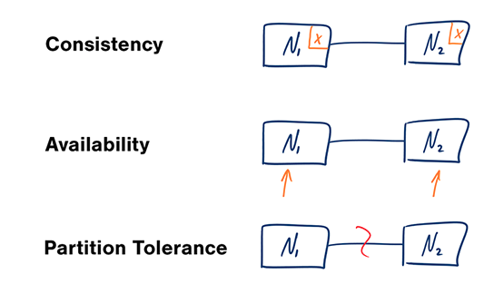

một số vấn đề cơ bản của distributed systems

# CAP

- Consistency - Every read receives the most recent write or an error
- Availability - Every request receives a response, without guarantee that it contains the most recent version of the information
- Partition Tolerance - The system continues to operate despite arbitrary partitioning due to network failures

# Lựa chọn 2 trong 3

Networks aren't reliable, so you'll need to support partition tolerance. You'll need to make a software tradeoff between consistency and availability.

- CP: kết nối giữa các node bị lỗi thì coi như timeout
- AP: kết nối giữa các node bị lỗi thì chấp nhận đọc data có thể là không mới nhất. dữ liệu sẽ được cập nhật khi có kết nối trở lại. dùng được cho các nghiệp vụ cần eventual consistency

# Consistency 

vấn đề với hệ thống phân tán là sync dữ liệu giữa các node. điều này lên quan tới tính consistency. một là nhận được dữ liệu đúng(mới nhất), hai là trả về lỗi

|phân loại | đặc điểm | ứng dụng |
|-|-|-|
|weak consitency| After a write, reads may or may not see it.  | memcache, realtime system(chat, game)| 
|eventual consistency| After a write, reads will eventually see it (typically within milliseconds). Data is replicated asynchronously. | DNS, email. sử dụng tốt cho các hệ thống ưu tiên tính avaiable| 
|strong consistency|After a write, reads will see it. Data is replicated synchronously. | RDBMS. transaction required.

# Avaiability
vấn đề với hệ thống phân tán là một node có thể gặp vấn đề(tách khỏi cụm - mất kết nối mạng, chết, chết rồi sống lại). khi đó mình vẫn cần trả về dữ liệu cho người dùng (không đảm bảo là dữ liệu mới nhất)

There are two complementary patterns to support high availability: fail-over and replication.

fail-over

### Active-passive
- gửi heartbeat, nếu không nhận lại thì vượt quá timeout thì lên làm active
- chỉ active handler request 
- có thể downtime để nó từ standby lên active. thời gian down = timeout + nó là hot standby hay cold standby(chạy lại dữ liệu mới có thể lên lại được)

### Active-active

- both servers are managing traffic, spreading the load between them

hạn chế của fail over: phức tạp, có thể mất data nếu không sync kịp dữ liệu tới passive

replication

### Master-slave replication

- sync code tới slave. write/ read vào master. slave chỉ được read

### Master-master replication
- cả 2 con đều đọc ghi và sync dữ liệu với nhau 
- cần load balancer hoặc application logic để xem nên đọc ghi vào con nào 
- tăng latency do cần sync dữ liệu 

hạn chế của replication: 
- có thể mất dữ liệu trước khi được sync
- replication lag khi có càng nhiều replication
- phức tạp hơn

# Ref 

[system-design-primer](https://github.com/donnemartin/system-design-primer?tab=readme-ov-file#cap-theorem)

